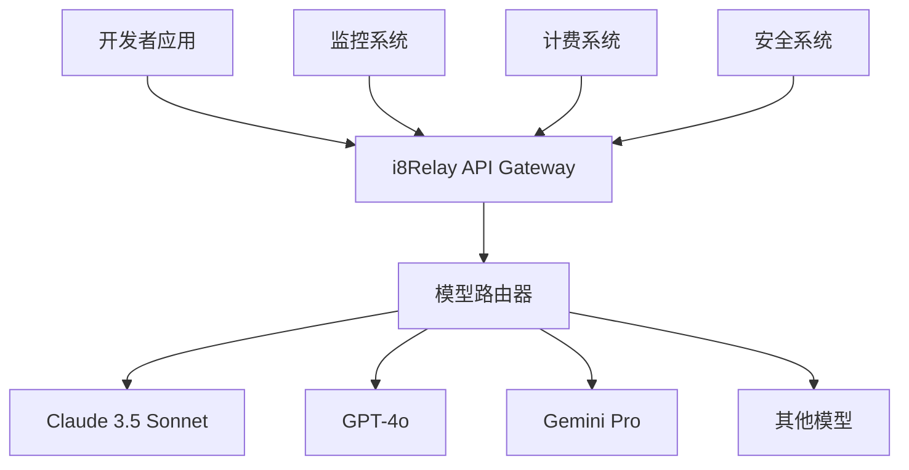

# i8Relay 使用指南

本指南将带您深入了解 i8Relay 的各项功能，帮助您充分发挥AI工具的潜力，提升开发效率。

## 核心概念

### 什么是 i8Relay？

i8Relay 是一个智能的AI模型中继平台，提供以下核心价值：

- **统一接口**: 一套API访问多种AI模型
- **智能路由**: 自动选择最适合的模型
- **成本优化**: 智能分配请求，降低使用成本
- **安全保障**: 企业级安全和隐私保护

### 核心组件



## 基础使用

### 1. 项目设置

#### 创建项目

1. 登录 [i8Relay 控制台](https://console.i8relay.com)
2. 点击「创建项目」
3. 填写项目信息：
   ```
   项目名称: my-ai-app
   描述: 我的AI应用项目
   标签: development, ai, chatbot
   ```
4. 获取API密钥

#### 环境配置

创建 `.env` 文件：

```bash
# i8Relay 配置
I8RELAY_API_KEY=your-api-key-here
I8RELAY_BASE_URL=https://api.i8relay.com

# 可选配置
I8RELAY_ORG_ID=your-org-id
I8RELAY_PROJECT_ID=your-project-id
```

### 2. 第一个请求

#### 聊天补全

```javascript
import { I8Relay } from '@i8relay/sdk';

const client = new I8Relay({
  apiKey: process.env.I8RELAY_API_KEY
});

async function basicChat() {
  const response = await client.chat.completions.create({
    model: 'claude-3.5-sonnet',
    messages: [
      { role: 'user', content: '你好，请介绍一下你自己' }
    ],
    max_tokens: 1000
  });

  console.log(response.choices[0].message.content);
}

basicChat();
```

#### 代码生成

```python
import i8relay

client = i8relay.Client(api_key="your-api-key")

def generate_function():
    response = client.chat.completions.create(
        model="gpt-4o",
        messages=[
            {
                "role": "system",
                "content": "你是一个专业的Python开发者，请生成高质量的代码。"
            },
            {
                "role": "user",
                "content": "创建一个计算斐波那契数列的函数，要求使用动态规划优化"
            }
        ],
        max_tokens=500
    )

    return response.choices[0].message.content

code = generate_function()
print(code)
```

## 高级功能

### 1. 模型选择策略

#### 智能路由

```javascript
// 自动选择最适合的模型
const response = await client.chat.completions.create({
  model: 'auto', // 让 i8Relay 自动选择
  messages: [
    { role: 'user', content: '分析这段代码的时间复杂度' }
  ],
  task_type: 'code_analysis' // 提示任务类型
});
```

#### 手动选择

```javascript
// 根据不同场景选择模型
const models = {
  coding: 'claude-3.5-sonnet',      // 编程任务
  creative: 'gpt-4o',               // 创意写作
  analysis: 'gpt-4-turbo',          // 数据分析
  conversation: 'gpt-3.5-turbo'     // 日常对话
};

function selectModel(taskType) {
  return models[taskType] || 'gpt-4';
}
```

### 2. 流式响应

#### JavaScript 流式处理

```javascript
async function streamChat() {
  const stream = await client.chat.completions.create({
    model: 'claude-3.5-sonnet',
    messages: [
      { role: 'user', content: '请写一个关于AI发展的长篇文章' }
    ],
    stream: true
  });

  for await (const chunk of stream) {
    const content = chunk.choices[0]?.delta?.content || '';
    process.stdout.write(content);
  }
}
```

#### Python 流式处理

```python
def stream_response():
    stream = client.chat.completions.create(
        model="gpt-4o",
        messages=[
            {"role": "user", "content": "详细解释机器学习的工作原理"}
        ],
        stream=True
    )

    for chunk in stream:
        if chunk.choices[0].delta.content is not None:
            print(chunk.choices[0].delta.content, end="")
```

### 3. 函数调用

#### 定义工具函数

```javascript
const tools = [
  {
    type: "function",
    function: {
      name: "get_weather",
      description: "获取指定城市的天气信息",
      parameters: {
        type: "object",
        properties: {
          location: {
            type: "string",
            description: "城市名称，例如：北京、上海"
          },
          unit: {
            type: "string",
            enum: ["celsius", "fahrenheit"],
            description: "温度单位"
          }
        },
        required: ["location"]
      }
    }
  }
];

const response = await client.chat.completions.create({
  model: 'gpt-4o',
  messages: [
    { role: 'user', content: '北京今天天气怎么样？' }
  ],
  tools: tools,
  tool_choice: "auto"
});
```

#### 处理函数调用

```javascript
async function handleFunctionCall(response) {
  const message = response.choices[0].message;

  if (message.tool_calls) {
    for (const toolCall of message.tool_calls) {
      if (toolCall.function.name === 'get_weather') {
        const args = JSON.parse(toolCall.function.arguments);
        const weather = await getWeatherData(args.location);

        // 将结果返回给模型
        const followUp = await client.chat.completions.create({
          model: 'gpt-4o',
          messages: [
            { role: 'user', content: '北京今天天气怎么样？' },
            message,
            {
              role: 'tool',
              tool_call_id: toolCall.id,
              content: JSON.stringify(weather)
            }
          ]
        });

        return followUp.choices[0].message.content;
      }
    }
  }

  return message.content;
}
```

### 4. 批量处理

#### 并发请求

```javascript
async function batchProcess(prompts) {
  const promises = prompts.map(prompt =>
    client.chat.completions.create({
      model: 'gpt-3.5-turbo',
      messages: [{ role: 'user', content: prompt }]
    })
  );

  const results = await Promise.all(promises);
  return results.map(r => r.choices[0].message.content);
}

// 使用示例
const prompts = [
  '翻译这句话到英文：你好世界',
  '写一个Python排序函数',
  '解释什么是区块链'
];

const responses = await batchProcess(prompts);
```

#### 队列处理

```python
import asyncio
from asyncio import Queue

class RequestQueue:
    def __init__(self, client, max_concurrent=5):
        self.client = client
        self.queue = Queue()
        self.semaphore = asyncio.Semaphore(max_concurrent)

    async def add_request(self, messages, model='gpt-3.5-turbo'):
        await self.queue.put({
            'messages': messages,
            'model': model
        })

    async def process_requests(self):
        while True:
            request = await self.queue.get()
            async with self.semaphore:
                response = await self.client.chat.completions.create(**request)
                yield response
            self.queue.task_done()
```

## 实际应用场景

### 1. 聊天机器人

#### 基础聊天机器人

```javascript
class ChatBot {
  constructor(apiKey) {
    this.client = new I8Relay({ apiKey });
    this.conversation = [];
  }

  async chat(userMessage) {
    // 添加用户消息到对话历史
    this.conversation.push({
      role: 'user',
      content: userMessage
    });

    const response = await this.client.chat.completions.create({
      model: 'claude-3.5-sonnet',
      messages: [
        {
          role: 'system',
          content: '你是一个友善的AI助手，请用中文回答问题。'
        },
        ...this.conversation
      ],
      max_tokens: 1000
    });

    const botMessage = response.choices[0].message.content;

    // 添加机器人回复到对话历史
    this.conversation.push({
      role: 'assistant',
      content: botMessage
    });

    // 限制对话历史长度
    if (this.conversation.length > 20) {
      this.conversation = this.conversation.slice(-20);
    }

    return botMessage;
  }
}

// 使用示例
const bot = new ChatBot(process.env.I8RELAY_API_KEY);
const reply = await bot.chat('你能帮我解释一下什么是机器学习吗？');
console.log(reply);
```

#### 带上下文的智能助手

```python
class IntelligentAssistant:
    def __init__(self, api_key):
        self.client = i8relay.Client(api_key=api_key)
        self.context = {
            'user_profile': {},
            'conversation_history': [],
            'current_task': None
        }

    async def process_message(self, message, user_id=None):
        # 构建系统提示
        system_prompt = self._build_system_prompt()

        # 准备消息
        messages = [
            {"role": "system", "content": system_prompt},
            *self.context['conversation_history'][-10:],  # 最近10条消息
            {"role": "user", "content": message}
        ]

        response = await self.client.chat.completions.create(
            model="gpt-4o",
            messages=messages,
            max_tokens=1500,
            temperature=0.7
        )

        assistant_message = response.choices[0].message.content

        # 更新对话历史
        self.context['conversation_history'].extend([
            {"role": "user", "content": message},
            {"role": "assistant", "content": assistant_message}
        ])

        return assistant_message

    def _build_system_prompt(self):
        return f"""
你是一个智能助手，具有以下特点：
1. 根据用户的历史对话调整回答风格
2. 记住用户的偏好和需求
3. 能够处理复杂的多轮对话
4. 当前任务：{self.context.get('current_task', '通用助手')}

请用友好、专业的语气回答用户问题。
"""
```

### 2. 代码助手

#### 代码生成器

```javascript
class CodeGenerator {
  constructor(apiKey) {
    this.client = new I8Relay({ apiKey });
  }

  async generateFunction(description, language = 'javascript') {
    const prompt = `
请生成一个${language}函数，要求：
${description}

请包含：
1. 完整的函数实现
2. 详细的注释
3. 使用示例
4. 时间和空间复杂度分析
`;

    const response = await this.client.chat.completions.create({
      model: 'claude-3.5-sonnet',
      messages: [
        {
          role: 'system',
          content: `你是一个专业的${language}开发者，请生成高质量、可维护的代码。`
        },
        { role: 'user', content: prompt }
      ],
      max_tokens: 2000
    });

    return response.choices[0].message.content;
  }

  async optimizeCode(code, language = 'javascript') {
    const prompt = `
请优化以下${language}代码：

${code}

请提供：
1. 优化后的代码
2. 优化点说明
3. 性能提升分析
`;

    const response = await this.client.chat.completions.create({
      model: 'gpt-4o',
      messages: [
        {
          role: 'system',
          content: '你是一个代码优化专家，专注于性能和可读性提升。'
        },
        { role: 'user', content: prompt }
      ]
    });

    return response.choices[0].message.content;
  }
}
```

#### 代码审查工具

```python
class CodeReviewer:
    def __init__(self, api_key):
        self.client = i8relay.Client(api_key=api_key)

    async def review_code(self, code, language, focus_areas=None):
        focus = focus_areas or ['security', 'performance', 'maintainability']

        prompt = f"""
请审查以下{language}代码，重点关注：{', '.join(focus)}

代码：
```{language}
{code}
```

请提供：
1. 问题分析（按严重程度分级）
2. 具体的改进建议
3. 重构后的代码示例
4. 最佳实践建议
"""

        response = await self.client.chat.completions.create(
            model="claude-3.5-sonnet",
            messages=[
                {
                    "role": "system",
                    "content": "你是一个资深的代码审查专家，请提供详细、专业的代码审查报告。"
                },
                {"role": "user", "content": prompt}
            ],
            max_tokens=2500
        )

        return response.choices[0].message.content

    async def generate_tests(self, function_code, test_framework='pytest'):
        prompt = f"""
为以下函数生成完整的单元测试，使用{test_framework}框架：

{function_code}

请包含：
1. 正常情况测试
2. 边界条件测试
3. 异常情况测试
4. 性能测试（如适用）
"""

        response = await self.client.chat.completions.create(
            model="gpt-4o",
            messages=[
                {
                    "role": "system",
                    "content": f"你是一个测试专家，精通{test_framework}框架，请生成全面的单元测试。"
                },
                {"role": "user", "content": prompt}
            ]
        )

        return response.choices[0].message.content
```

### 3. 文档生成

#### API 文档生成器

```javascript
class DocGenerator {
  constructor(apiKey) {
    this.client = new I8Relay({ apiKey });
  }

  async generateAPIDoc(code, format = 'markdown') {
    const prompt = `
分析以下代码并生成${format}格式的API文档：

${code}

文档应包含：
1. 函数/方法描述
2. 参数说明（类型、默认值、是否必需）
3. 返回值说明
4. 使用示例
5. 错误处理说明
6. 注意事项
`;

    const response = await this.client.chat.completions.create({
      model: 'claude-3.5-sonnet',
      messages: [
        {
          role: 'system',
          content: '你是一个技术文档专家，擅长编写清晰、详细的API文档。'
        },
        { role: 'user', content: prompt }
      ]
    });

    return response.choices[0].message.content;
  }

  async generateUserGuide(features, audience = 'developers') {
    const prompt = `
为${audience}编写用户指南，涵盖以下功能：

${features.map(f => `- ${f}`).join('\n')}

指南应包含：
1. 快速开始
2. 详细功能说明
3. 配置选项
4. 常见问题
5. 故障排除
6. 最佳实践
`;

    const response = await this.client.chat.completions.create({
      model: 'gpt-4o',
      messages: [
        {
          role: 'system',
          content: '你是一个技术写作专家，擅长为不同受众编写易懂的文档。'
        },
        { role: 'user', content: prompt }
      ]
    });

    return response.choices[0].message.content;
  }
}
```

## 性能优化

### 1. 响应时间优化

#### 预热请求

```javascript
class WarmupManager {
  constructor(client) {
    this.client = client;
    this.warmupInterval = 5 * 60 * 1000; // 5分钟
  }

  startWarmup() {
    setInterval(async () => {
      try {
        await this.client.chat.completions.create({
          model: 'gpt-3.5-turbo',
          messages: [{ role: 'user', content: 'ping' }],
          max_tokens: 1
        });
      } catch (error) {
        console.log('Warmup request failed:', error);
      }
    }, this.warmupInterval);
  }
}
```

#### 请求缓存

```javascript
import NodeCache from 'node-cache';

class CachedClient {
  constructor(apiKey, cacheOptions = { stdTTL: 600 }) {
    this.client = new I8Relay({ apiKey });
    this.cache = new NodeCache(cacheOptions);
  }

  async cachedCompletion(params) {
    const cacheKey = this.generateCacheKey(params);
    const cached = this.cache.get(cacheKey);

    if (cached) {
      return cached;
    }

    const response = await this.client.chat.completions.create(params);
    this.cache.set(cacheKey, response);

    return response;
  }

  generateCacheKey(params) {
    return Buffer.from(JSON.stringify(params)).toString('base64');
  }
}
```

### 2. 成本优化

#### 智能模型降级

```python
class CostOptimizer:
    def __init__(self, client):
        self.client = client
        self.model_costs = {
            'gpt-4o': 0.03,
            'gpt-4-turbo': 0.02,
            'gpt-4': 0.015,
            'gpt-3.5-turbo': 0.002
        }

    def select_optimal_model(self, task_complexity, budget_limit):
        if task_complexity < 0.3 and budget_limit < 0.01:
            return 'gpt-3.5-turbo'
        elif task_complexity < 0.6:
            return 'gpt-4'
        elif budget_limit > 0.02:
            return 'gpt-4o'
        else:
            return 'gpt-4-turbo'

    async def cost_aware_completion(self, messages, max_cost=0.05):
        # 估算token数量
        estimated_tokens = sum(len(m['content'].split()) for m in messages) * 1.3

        for model in ['gpt-3.5-turbo', 'gpt-4', 'gpt-4-turbo', 'gpt-4o']:
            estimated_cost = (estimated_tokens / 1000) * self.model_costs[model]

            if estimated_cost <= max_cost:
                return await self.client.chat.completions.create(
                    model=model,
                    messages=messages
                )

        raise ValueError(f"No model available within budget: ${max_cost}")
```

## 监控和调试

### 1. 请求监控

```javascript
class RequestMonitor {
  constructor(client) {
    this.client = client;
    this.stats = {
      totalRequests: 0,
      successfulRequests: 0,
      failedRequests: 0,
      totalLatency: 0,
      requestsByModel: {}
    };
  }

  async monitoredRequest(params) {
    const startTime = Date.now();
    this.stats.totalRequests++;

    try {
      const response = await this.client.chat.completions.create(params);

      this.stats.successfulRequests++;
      this.stats.totalLatency += Date.now() - startTime;

      const model = params.model;
      this.stats.requestsByModel[model] =
        (this.stats.requestsByModel[model] || 0) + 1;

      return response;
    } catch (error) {
      this.stats.failedRequests++;
      throw error;
    }
  }

  getStats() {
    const avgLatency = this.stats.totalLatency / this.stats.successfulRequests;
    const successRate = this.stats.successfulRequests / this.stats.totalRequests;

    return {
      ...this.stats,
      averageLatency: avgLatency,
      successRate: successRate
    };
  }
}
```

### 2. 错误处理

```python
import logging
from tenacity import retry, stop_after_attempt, wait_exponential

class RobustClient:
    def __init__(self, api_key):
        self.client = i8relay.Client(api_key=api_key)
        self.logger = logging.getLogger(__name__)

    @retry(
        stop=stop_after_attempt(3),
        wait=wait_exponential(multiplier=1, min=4, max=10)
    )
    async def resilient_completion(self, **params):
        try:
            response = await self.client.chat.completions.create(**params)
            return response
        except i8relay.RateLimitError as e:
            self.logger.warning(f"Rate limit exceeded: {e}")
            raise
        except i8relay.APIError as e:
            self.logger.error(f"API error: {e}")
            raise
        except Exception as e:
            self.logger.error(f"Unexpected error: {e}")
            raise

    async def safe_completion(self, **params):
        try:
            return await self.resilient_completion(**params)
        except Exception as e:
            # 返回默认响应
            return {
                "choices": [{
                    "message": {
                        "content": "抱歉，当前无法处理您的请求，请稍后重试。"
                    }
                }]
            }
```

## 下一步

掌握了基础使用后，您可以：

- [探索高级 API 功能](/docs/api/advanced)
- [学习最佳实践](/docs/guides/best-practices)
- [查看更多使用案例](/docs/guides/use-cases)
- [了解安全配置](/docs/article/security)